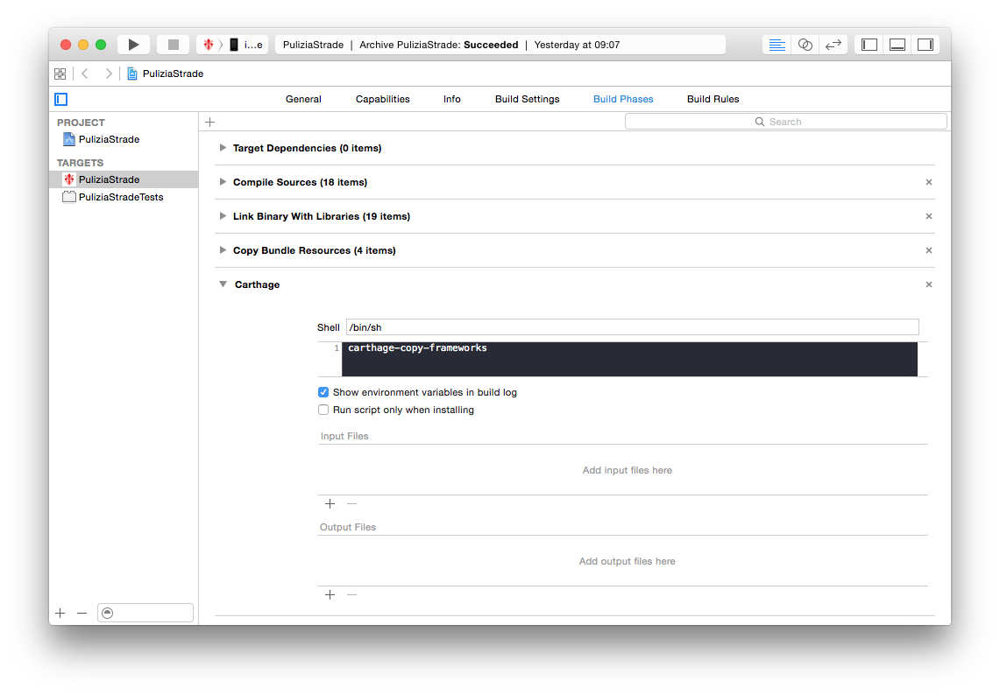

carthage-copy-frameworks
========================

# Overview

`carthage-copy-frameworks` is an helper script that you can use to automatically copy every
framework below `Carthage/Build/iOS`. This way you can avoid [the official, error prone,
process](https://github.com/Carthage/Carthage#if-youre-building-for-ios).

As the name implies, this is meant to be used in iOS development, alongside
[Carthage](https://github.com/Carthage/Carthage).

# Installation

If you are on OS X and have Homebrew's Python:

    pip install carthage-copy-frameworks

Otherwise:

    pip install --user carthage-copy-frameworks

Then make sure to add the local pip's `bin` directory to the `$PATH`. Since it is different on each
platform, please refer to its documentation.

Otherwise, if you're feeling a badass and want to `sudo` your way out, then run:

    sudo pip install carthage-copy-frameworks

# Usage

1. Open your target configuration.
2. Click on "Build Phases".
3. Click on the plus ("+") button.

-----

Click on "New Run Script Phase"

-----

In the script text field type `carthage-copy-frameworks`, as shown in the picture.

# Notes

Frameworks are not copied over and over again. This means that updated dependencies might not be
picked up until you perform a clean build.
